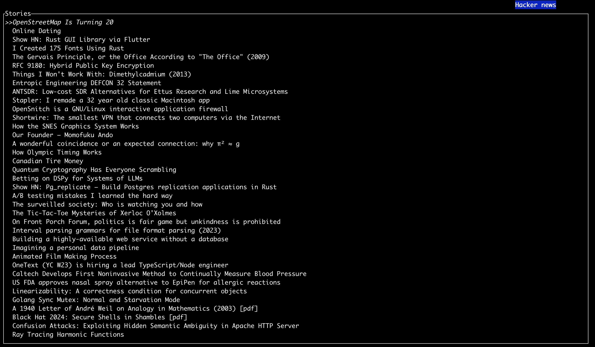
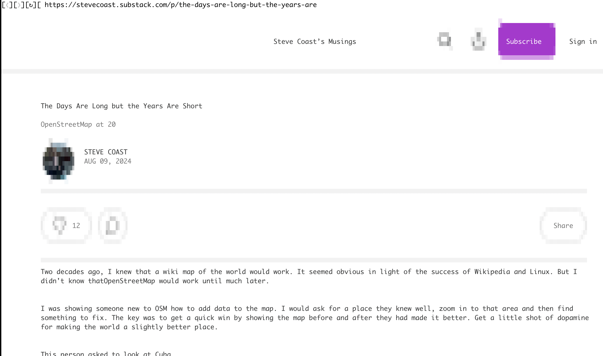

# HNR
Hacker News Cli reader

As I was getting rusty at writing rust code I've decided to make a little CLI program to read Hacker News
it features ratatui for cli, asynchronous programming with lazy load of news

TODO:

-  [x] Load more news when near the end of news up to 500.
-  [ ] Configuration screen for setting external browser (lynx, carbonyl or browsh)
-  [ ] Comment section for news
-  [ ] Bottom bar showing commands and story detail

Currently the function `open_in_browser` in `main.rs` expect [carbonyl](https://github.com/fathyb/carbonyl) under the  `carbonyl-0.0.3` folder, it can be replaced with `lynx` but there's some issue with delay of input after returning from the screen until it catch up...

Screenshot
==

